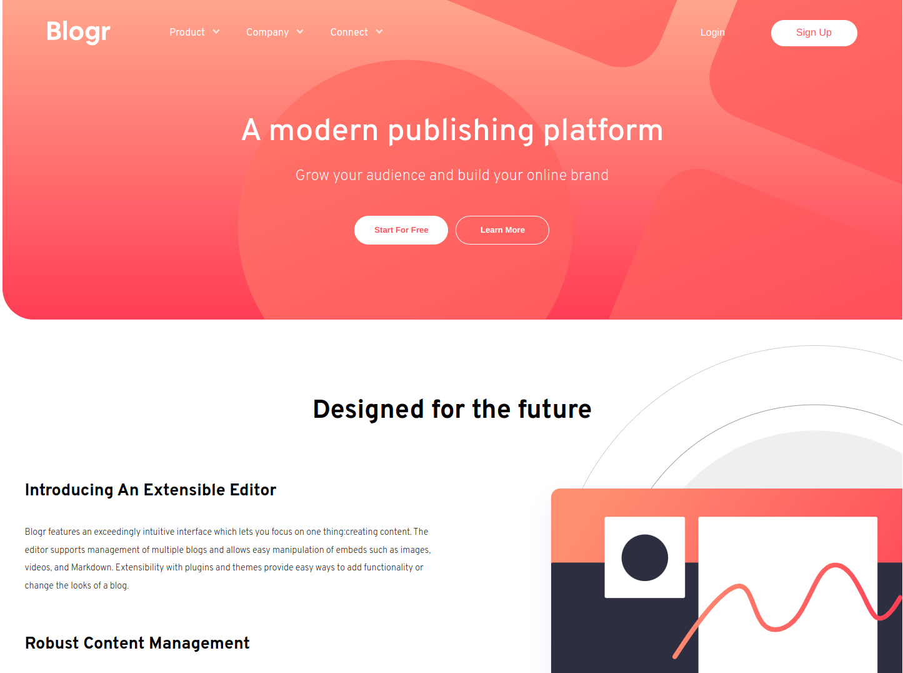
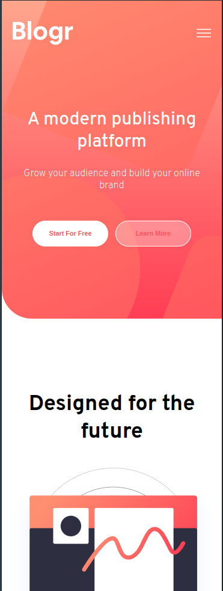
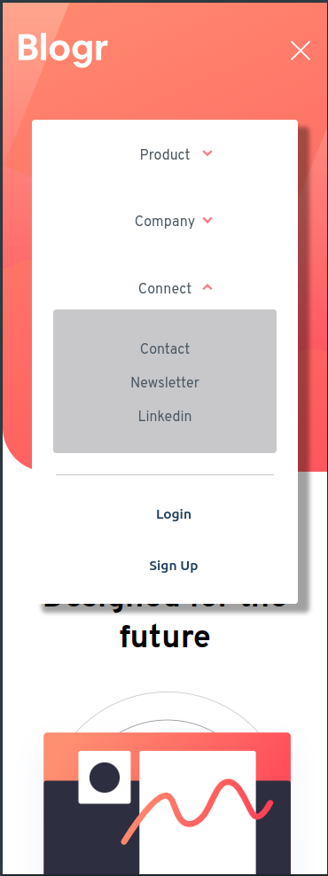

# Frontend Mentor - Blogr landing page solution

This is a solution to the [Blogr landing page challenge on Frontend Mentor](https://www.frontendmentor.io/challenges/blogr-landing-page-EX2RLAApP). Frontend Mentor challenges help you improve your coding skills by building realistic projects.

## Table of contents

- [Frontend Mentor - Blogr landing page solution](#frontend-mentor---blogr-landing-page-solution)
  - [Table of contents](#table-of-contents)
  - [Overview](#overview)
    - [The challenge](#the-challenge)
    - [Screenshot](#screenshot)
    - [Links](#links)
  - [My process](#my-process)
    - [Built with](#built-with)
    - [What I learned](#what-i-learned)

## Overview

### The challenge

Users should be able to:

- View the optimal layout for the site depending on their device's screen size
- See hover states for all interactive elements on the page

### Screenshot

### Links

- Solution URL: (https://github.com/DeDe-code/blogr-landing-page.git)
- Live Site URL: (https://fmentor-blogr-landing-page.netlify.app/)

## My process

### Built with

- JS
- CSS

### What I learned

I used this project to learn more about JS, especial JS modules

###Author

- Frontend Mentor - [@DeDe-code](https://www.frontendmentor.io/profile/DeDe-code)
